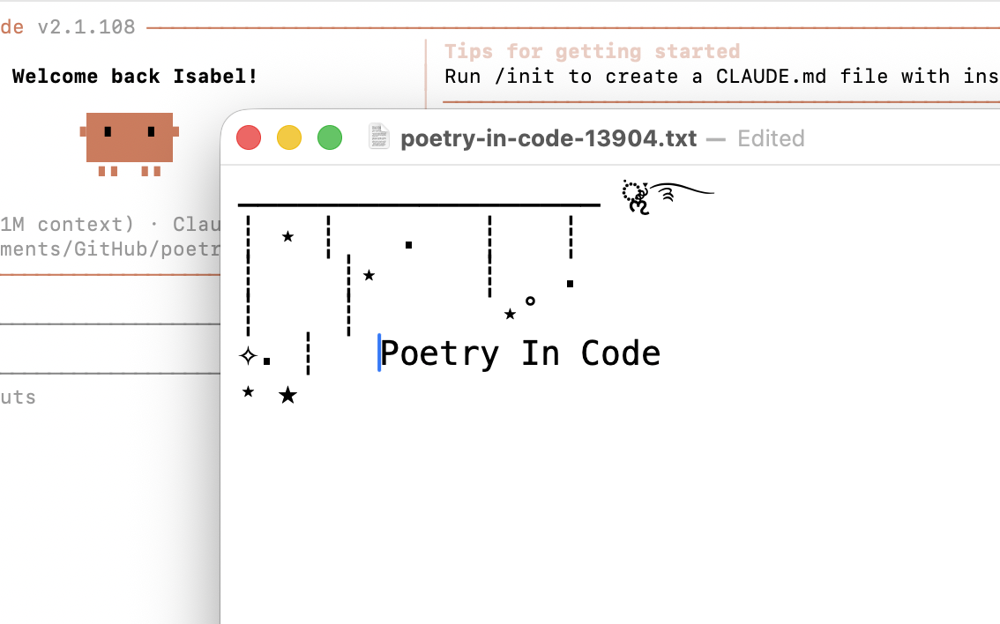

# Poetry In Code



A Claude Code plugin that gives you a poem whenever you send Claude a prompt. Inspired by [Poetry in Motion](https://poetrysociety.org/poetry-in-motion), an initiative that places poetry in the transit systems of U.S. cities. 

## Requirements

### macOS

- Claude Code (plugins are in public beta)
- `jq` on your PATH (standard on macOS with Homebrew; `brew install jq` if missing)
- `python3` on your PATH (preinstalled on macOS)
- Terminal.app or iTerm2 as your terminal

### Windows

- Claude Code (plugins are in public beta)
- PowerShell 5.1+ (preinstalled on Windows 10/11)
- No additional dependencies — the PowerShell script handles JSON parsing and file operations natively

## Install from a marketplace

Inside Claude Code:

```
/plugin marketplace add isabelringing1/poetry-in-code
/plugin install poetry-in-code@poetry-in-code-marketplace
```

## Run locally (for development)

From the directory that contains this plugin folder:

```bash
claude --plugin-dir ./poetry-in-code
```

## License

MIT for the plugin code. Poems are public domain. Feel free to submit more via PR!

